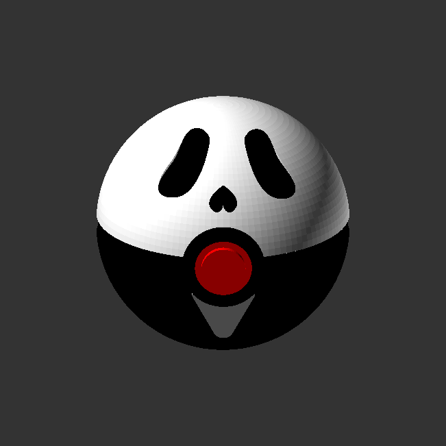

# Slasher Spheres: Ghostface Pokéball

  

A multi-part, support-free 3D model merging the classic Pokéball with the haunting visage of Ghostface from the *Scream* franchise. Designed entirely in OpenSCAD for high-precision assembly, featuring **recessed eye and nose sockets** for a natural shadow effect, an integrated **rounded triangle mouth**, and a **flattened base** for shelf stability.

## 📂 Project Structure

- `ghostface_ball.scad` — The core parametric OpenSCAD model.
- `ghostface-ball-top.stl` — The white top hemisphere featuring deep recessed eye and nose pockets.
- `ghostface-ball-bottom.stl` — The black bottom hemisphere with a **flattened base** and a dedicated mouth pocket.
- `ghostface-ball-ring.stl` — The main black equatorial band.
- `ghostface-ball-front-ring.stl` — The outer black button housing.
- `ghostface-ball-button.stl` — The stepped center red button.
- `ghostface-ball-filler.stl` — The rectangular internal alignment peg.
- `ghostface-chips-black.stl` — The black eye and nose inserts (recessed fit).
- `ghostface-chips-white.stl` — The white mouth insert, featuring a custom cutout to sit flush around the front ring.
- `images/`
  - `ghostface-ball-exploded.png` — Exploded assembly preview.
  - `ghostface-pokeball-hero.png` — Final assembled hero shot.
- `README.md` — This file.

## 🛠 Print Instructions

This model is designed to be printed in separate color batches and assembled.

### Slicer Settings

- **Material:** PLA or PETG.
- **Layer Height:** 0.2mm
- **Seam Position:** **Back (REQUIRED).** Set Z-seam alignment to the back of the model to ensure clean surface finishes on all facial features and insert pockets.
- **Orientation / Supports:** **NO SUPPORTS REQUIRED.** All shells and rings are designed with flat mating surfaces for the build plate.
- **Wall Perimeters:** **3 to 4 walls.** Extra walls ensure the pocket floors are solid plastic rather than fragile infill.
- **Infill:** 15% Gyroid for shells; **100% Infill for all Chips** (black and white) to prevent snapping during press-fit installation.
- **Elephant Foot Compensation:** 0.15mm. **CRITICAL!** If the first layer squishes, the high-tolerance chips will not seat properly.

---

## 🧩 Assembly & Fit Guide

This model utilizes a **full friction-fit assembly** designed for minimal glue.

1. **Recessed "Shadow" Effect:** The eyes and nose are designed with a **3.5mm pocket depth** and a **2.5mm chip thickness**. This creates a 1mm physical recess, providing natural shadows for a more accurate mask look.
2. **Installation Steps:**
   - **Step 1 (The Face):** Press the black eyes and nose chips into the top shell. Press the white mouth triangle into the bottom shell. The mouth is designed to wrap perfectly around the center ring housing.
   - **Step 2 (The Core):** Insert the rectangular filler peg into the flattened bottom shell. Slide the center ring over the peg, then press the top shell down.
   - **Step 3 (The Button):** Press the red button into the black front ring, then press that assembly into the front cutout of the sphere.

3. **Troubleshooting:**
   - **Too Loose?** If parts do not stay seated due to printer variance, a tiny drop of CA glue (Super Glue) can be used.
   - **Too Tight?** If inserts are impossible to press in, check for over-extrusion or slightly lower your outer wall flow rate (by **2-5%**).
   - **Mouth Alignment:** Ensure the white mouth chip is seated fully before installing the front ring; the ring acts as the final "lock" for the mouth geometry.

---

## 🔧 Customization

To adjust the tightness for your specific printer, open `ghostface_ball.scad` and tweak the clearance variables:

- `mechanical_clearance = 0.05;` (Controls internal peg and button assembly)
- `chip_clearance = 0.05;` (Controls face detail pocket fit)
- `eye_pocket_depth = 3.5;` (Controls how deep the recessed shadow is)

---

_Disclaimer: This is a fan-art project provided for personal use only. It is not affiliated with, authorized by, or endorsed by the Scream franchise, Dimension Films, Paramount Pictures, Pokémon, or Nintendo._