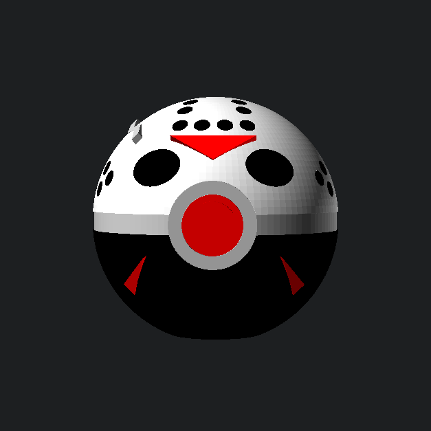

# Slasher Spheres: Jason Voorhees Pokéball

  

A multi-part, support-free 3D model combining a classic Pokéball with Jason Voorhees' iconic battle-worn hockey mask. Designed entirely in OpenSCAD for high-precision assembly, featuring flush-fitting inserts and a heavy-duty rectangular internal alignment peg.

## 📂 Project Structure

- `jason_ball.scad` — The core parametric OpenSCAD model.
- `jason-ball-top.stl` — The white top hemisphere featuring recessed mask pockets.
- `jason-ball-bottom.stl` — The solid black bottom hemisphere.
- `jason-ball-ring.stl` — The main silver equatorial band.
- `jason-ball-front-ring.stl` — The outer silver button housing.
- `jason-ball-button.stl` — The stepped center red button.
- `jason-ball-filler.stl` — The large rectangular internal alignment peg.
- `jason-ball-chips-black.stl` — The black eye and breathing hole inserts.
- `jason-ball-chips-red.stl` — The red chevron inserts.
- `jason-ball-chips-silver.stl` — The silver axe-notch crack insert.
- `images/`
  - `jason-ball-exploded.png` — Exploded assembly preview.
  - `jason-crack-ball-exploded.png` — Exploded view featuring the silver crack.
  - `jason-crack-pokeball-hero.png` — Battle-worn hero shot.
  - `jason-pokeball-hero.png` — Standard version hero shot.
- `README.md` — This file.

## 🛠 Print Instructions

This model is designed to be printed in separate color batches and assembled.

### Slicer Settings

- **Material:** PLA or PETG.
- **Layer Height:** 0.2mm
- **Orientation / Supports:** **NO SUPPORTS REQUIRED.** Print the shells and center ring with their large flat cutouts facing flat on the build plate. Print the filler peg lying flat for maximum sheer strength.
- **Wall Perimeters:** **3 to 4 walls.** Extra walls ensure the bottom of the pockets are solid plastic rather than fragile infill.
- **Infill:** 15% Gyroid for the shells. **100% Infill for all Chips** (black, red, and silver) to prevent snapping during installation.
- **Elephant Foot Compensation:** 0.15mm. *CRITICAL! If the first layer squishes, the chips will not fit into the precision pockets.*

## 🧩 Assembly & Fit Guide

This model uses a hybrid assembly approach: friction fit for hardware and glue-in for mask details.

1. **Dual-Tolerance Design:** - **Mechanical Parts (0.20mm clearance):** The filler peg, rings, and button are dimensioned for a snug slip-fit.
   - **Mask Chips (0.25mm clearance):** The eyes, holes, chevrons, and crack have slightly more clearance to drop in effortlessly.
2. **Installation:** - **Step 1 (The Face):** Glue the black, red, and silver chips into the top shell pockets. They sit $0.05mm$ proud of the surface for a deliberate, battle-worn look.
   - **Step 2 (The Core):** Insert the rectangular filler peg into the bottom shell. Slide the center ring over the peg, then press the top shell down.
   - **Step 3 (The Button):** Slide the red button into the silver front ring, then slide that assembly into the front cutout.
3. **Troubleshooting:**
   - **Too Tight?** Lightly sand the sides of the rectangular filler peg or check for over-extrusion.
   - **Chips won't go in?** Scrape the bottom edges of the chips with a hobby knife to remove any first-layer "elephant foot" squish.

## 🔧 Customization

To adjust the tightness of the fits, open `jason_ball.scad` and tweak the clearance variables:

- `mechanical_clearance = 0.2;` (Internal peg and button assembly)
- `chip_clearance = 0.25;` (Face detail pockets)

---

*Disclaimer: This is a fan-art project provided for personal use only. It is not affiliated with, authorized by, or endorsed by the Friday the 13th franchise, New Line Cinema, Pokémon, or Nintendo.*